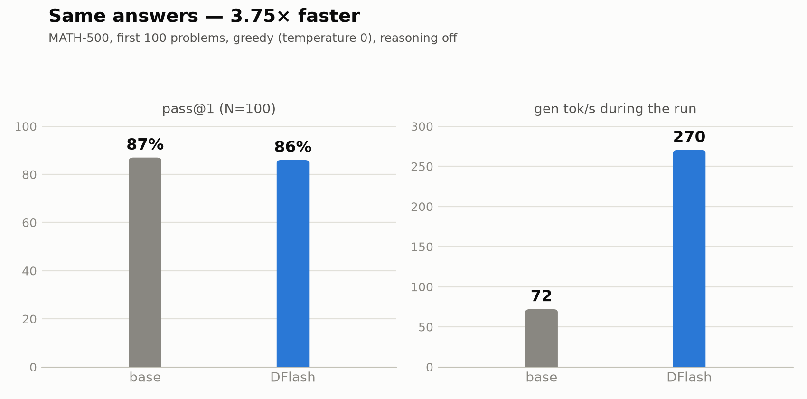
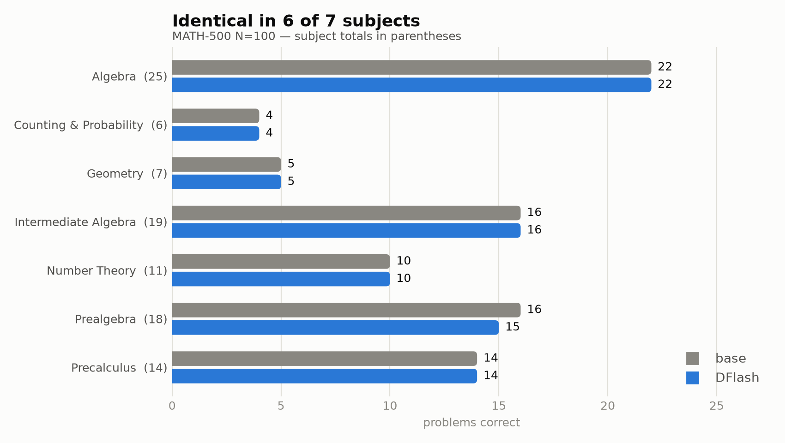
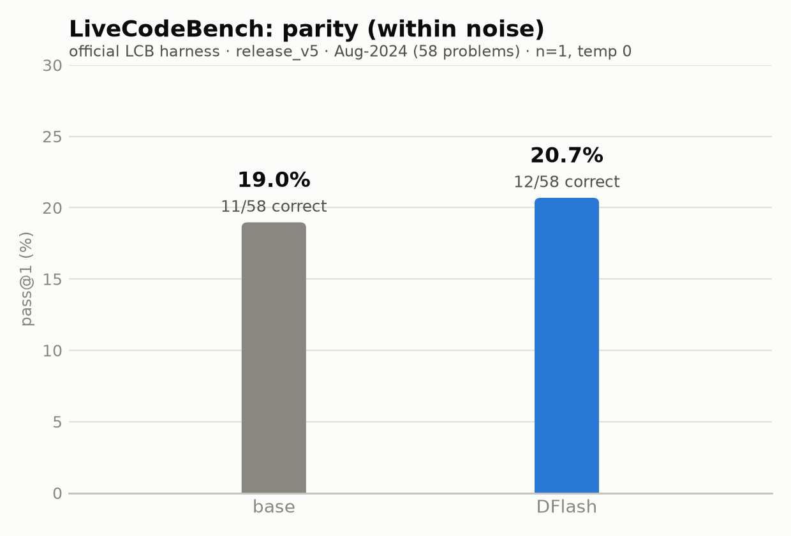
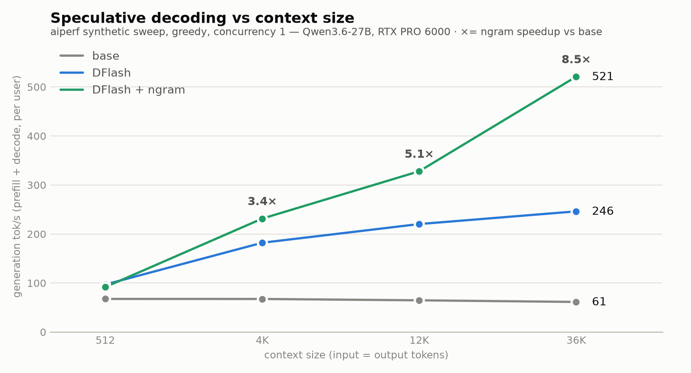
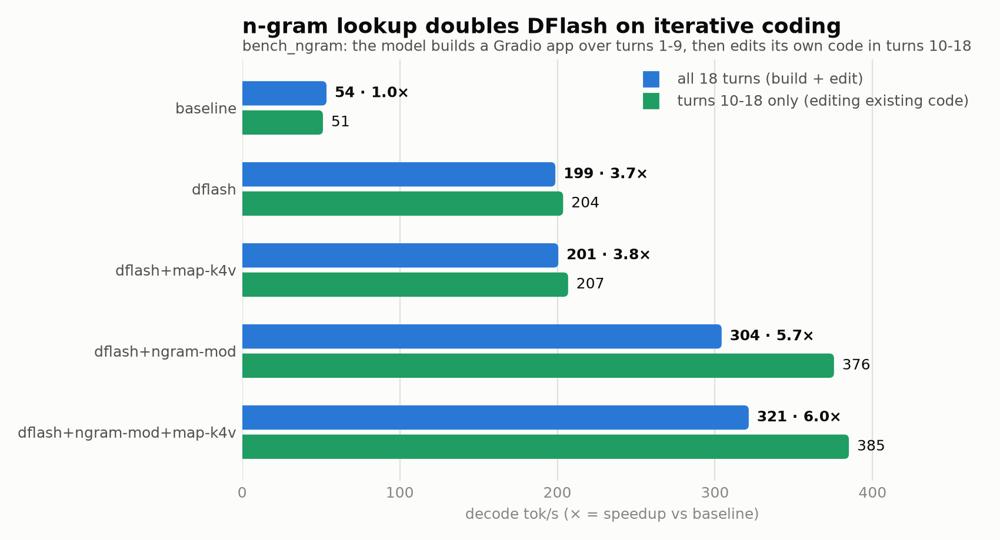
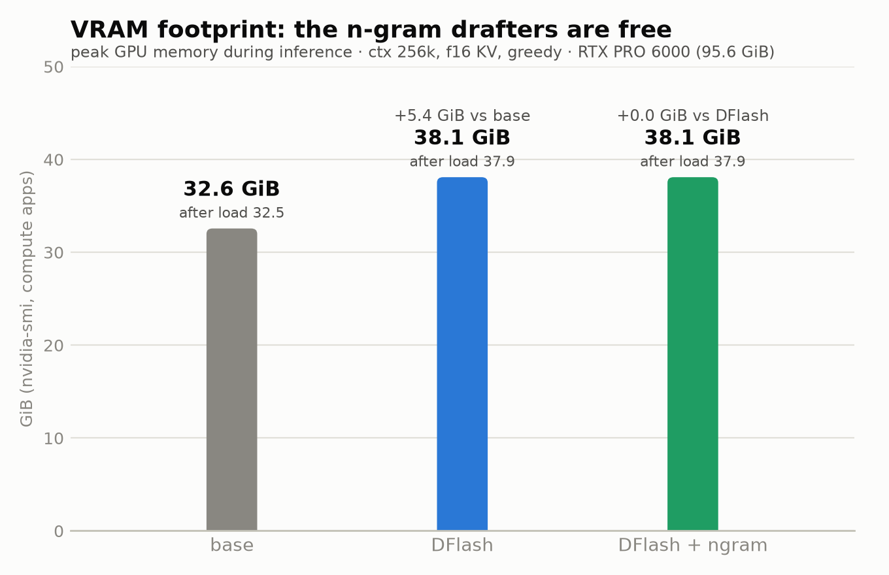

# DFlash

Qwen3.6-27B with **DFlash speculative decoding** on llama.cpp, benchmarked for
both **speed** (tok/s across context sizes) and **intelligence** (pass@1 on math
benchmarks) against a plain baseline and an MTP setup. Because greedy speculative
decoding is output-lossless, the questions these benchmarks answer are: *how much
faster is DFlash, and does it cost any accuracy?* Full setup, the "what broke and
how I fixed it" log, and the config knobs live in [`DFLASH.md`](DFLASH.md).

We discuss it here https://www.reddit.com/r/LocalLLaMA/comments/1uq0h4o/i_tested_freshly_merged_dflash_in_llamacpp_on/

## YouTube

LOCAL AI / SPECULATIVE DECODING SERIES:

- **NEW:** Up to 8x Faster AI N-gram Explained, Deployed & Benchmarked on Qwen 3 6 27B Lamma cpp! https://youtu.be/zNUoHONUHGk
- Up to 6x Faster AI? DFlash Explained, Deployed & Benchmarked on Qwen 3.6 27B. Lamma.cpp! https://www.youtube.com/watch?v=TUdihA_dJjo 

## Hardware

All numbers here are measured on a single card:

| | |
|---|---|
| **GPU** | NVIDIA RTX PRO 6000 Blackwell Workstation Edition (Blackwell, compute capability 12.0) |
| **VRAM** | 97 GB - target + draft both fit on one card |
| **Host** | Zen4 CPU |
| **llama.cpp** | `ghcr.io/ggml-org/llama.cpp:server-cuda13` - build `b9859` (commit `4fc4ec5`, image 2026-07-02), CUDA 13.3.0, needs driver >= 580 (or a 535+ branch listed by the image) |
| **GPU layout** | single GPU, `-ngl -1`, no tensor split |
| **Raw baseline** (no speculation) | **71 tok/s** generation (`llama bench` tg128) · **3877 tok/s** prompt processing (pp512) |

## Results summary

Consolidated numbers from the current runs. Machine-readable copy:
[`benchmark/results_summary.csv`](benchmark/results_summary.csv) (labeled
tables in one file); the charts below are generated from it by
[`benchmark/plot_results.py`](benchmark/plot_results.py) - regenerate with
`uv run benchmark/plot_results.py` (the script carries its own uv inline
deps, matplotlib only).

### Intelligence - MATH-500 pass@1, base vs DFlash (full set, N=500)



Both servers answered the **full 500-problem MATH-500 set** (sequential
sampling, seed 42), greedy (temperature 0), reasoning off, one server on the
GPU at a time. Zero request errors and zero unparsed answers on both sides.

| | base (`qwen3.6-27B`) | DFlash (`qwen36-dflash15test`) |
|---|---:|---:|
| pass@1 (N=500) | **440/500 (88.0%)** | **435/500 (87.0%)** |
| gen tok/s during the run | 73.07 | **254.67 (3.49×)** |
| wall-clock for 500 problems | 2 h 17 min | **44.7 min (3.06×)** |
| avg output tokens | 1,185 | 1,198 |

The earlier paired N=100 run told the same story: 87 vs 86 correct
(`qwen36-dflash10`, 270 tok/s, 3.75×) - both sample sizes are in
[`benchmark/results_summary.csv`](benchmark/results_summary.csv).



Per-subject scores stay **within 2 problems in every subject** (base ahead in
4, DFlash in 2, tied in 1). That is the expected result: greedy speculative
decoding verifies every drafted token against the target model, so it is
output-lossless; llama.cpp's batched verification has tiny floating-point
differences that can flip a borderline token, and a 5/500 (1%) gap is within
that noise. **DFlash costs no measurable accuracy and generated 3.5× faster
while being measured.** Commands and validity rules:
[Intelligence check](#intelligence-check--aiperf-accuracy-benchmark-math-500).

### Coding - LiveCodeBench pass@1, base vs DFlash

aiperf's built-in `lcb-codegeneration` grader **falsely reports 0%** on a full
run - a bug in aiperf's profiling pipeline, not the model or the spec path (the
model returns correct, executable code; aiperf's own grader scores that same
code 1.0 in isolation). The **official LiveCodeBench harness**, pointed at the
same llama.cpp server, gives a real number. Greedy (temperature 0), reasoning
off, `LLAMA_CTX=40960`, 58 problems from `release_v5` (Aug 2024 window), `--n 1`:



| | base (`qwen3.6-27B`) | DFlash (`qwen36-dflash15test`) |
|---|---:|---:|
| pass@1 | **11/58 (19.0%)** | **12/58 (20.7%)** |

Base and DFlash differ by a **single problem** - the same ≤1-problem noise seen
on MATH-500 (87 vs 86). Greedy speculative decoding is output-lossless in theory;
in practice llama.cpp's batched draft-verification has tiny floating-point
differences from the base model's sequential path that can flip a token on a
borderline logit, and one flipped token changes a long program's pass/fail. So
DFlash is effectively lossless on code; the 1-problem gap is noise, not a real
accuracy effect. (`--multiprocess` differs between the two runs but cannot affect
outputs at `--parallel 1` - the server processes requests one at a time.)

> **Caveat - these absolute scores are truncation-dominated.** The runs used
> lcb_runner's default `--max_tokens 2000`
> (`lcb_runner/runner/parser.py`), and this model reasons in plain prose
> before writing code even with `--reasoning off`. Result: 47/58 (base) and
> 46/58 (DFlash) generations were cut off mid-reasoning before any
> ```` ```python ```` block and auto-failed on extraction - while **every
> generation that fit the cap passed** (11/11 and 12/12). So the base-vs-DFlash
> **parity comparison is fair** (both truncated identically), but ~19-21%
> understates the model. For real capability numbers re-run both sides with
> `--max_tokens 16000` (fits in `LLAMA_CTX=40960`).

### Speed sweep - base vs DFlash vs DFlash+ngram



aiperf synthetic sweep (ISL = OSL, greedy, concurrency 1, 3-30 requests per
size - fewer as size grows); tok/s = `OSL / (TTFT + OSL × avg ITL)` per user -
the same definition for every column. Artifacts in
`artifacts/{base,dflash,dflash_ngram}/speed/`.
[How the synthetic benchmark works](#how-the-synthetic-benchmark-works-islosl-greedy).

| Context (ISL=OSL) | base tok/s | DFlash tok/s | +ngram tok/s | DFlash speedup | ngram speedup | base ITL (ms) | DFlash ITL (ms) | ngram ITL (ms) |
|---:|---:|---:|---:|---:|---:|---:|---:|---:|
| 512 | 67.62 | 96.88 | 91.85 | **1.43×** | 1.36× | 14.20 | 9.65 | 10.19 |
| 4 096 | 67.53 | 191.52 | **231.44** | 2.84× | **3.43×** | 14.46 | 4.83 | 3.91 |
| 12 288 | 64.78 | 233.98 | **327.99** | 3.61× | **5.06×** | 15.11 | 3.92 | 2.66 |
| 36 864 | 61.47 | 289.34 | **520.87** | 4.71× | **8.47×** | 15.91 | 3.06 | 1.51 |

DFlash with reasoning on measured 96.61 / 166.64 / 240.41 tok/s at
512 / 4 096 / 12 288, and 241.44 at 98 304.

Caveats on this table (DFlash column fully re-swept 2026-07-15 at ctx 256k):

- **DFlash 36 864 is now measured symmetric with the ngram point.** The
  re-sweep uses the compose default `-c 256000`; earlier DFlash runs used
  `LLAMA_CTX=40960`, so their 36 864 run stopped at ~8.2k output tokens when
  the window filled (those runs measured ITL 3.68 ms / ~272 tok/s). With the
  full 36 864-token output generated, ITL drops to 3.06 ms and the point
  rises to 289 tok/s (4.71×). The 512 point is unchanged (96.98 → 96.88), so
  the bigger KV allocation itself costs nothing; 4 096 / 12 288 improved ~5%
  (faster prefill and slightly lower ITL on the current image build).
- **ngram 36 864 (8.47×) is a best-case ceiling, not typical.** The full
  stack was confirmed via `docker inspect`, and the 36 864 pair is now
  symmetric - same ctx 256k, both generating the full 36 864 tokens - which
  puts the ngram stack's edge over plain DFlash at **1.80×** (520.87 vs
  289.34). The remaining inflation is degeneration: greedy 36k-token
  synthetic output collapses into repetition - exactly what the n-gram
  drafters copy - and it lifts plain DFlash's acceptance too (its ITL fell
  3.68 → 3.06 once the output ran full length, despite attending over a KV
  twice as deep). Treat 8.47× and 4.71× as long-degenerate-output ceilings;
  the realistic multi-turn number is the
  [iterative-coding ablation](#iterative-coding---the-n-gram-ablation-bench_ngram) (~6×).
- **The degeneration was verified directly (2026-07-15)** by replaying the
  exact 36 864 benchmark request on the ngram server. The repetition does
  NOT come from the input: aiperf's synthetic prompts are disjoint
  Shakespeare-corpus chunks with ~0% duplicate 12-grams, zero duplicate
  24-grams, and zero cross-prompt overlap, and 0.0% of the output's 12-grams
  appear in the input. What happens is self-repetition: forced past its
  natural stop by `ignore_eos`, the model opens with a genuine
  *Love's Labour's Lost* continuation, then locks into a two-line loop
  ("ARMADO: I will be faithful. / MOTH: And so will I, sir.") repeated
  ~1,514×; 98.3% of output 12-grams are duplicates. The replay measured
  **92% draft acceptance (35 898/38 908) and 748 tok/s** server-side decode -
  vs 9-14% acceptance and 75-105 tok/s on the natural-story probe
  (`artifacts/dflash_ngram/speed/acceptance.txt`).
- **Synthetic prompts are otherwise the n-gram worst case**: the disjoint
  prose chunks give the lookup drafters almost nothing to copy (draft accept
  9-14% on the shorter sizes), yet +ngram still leads at 4K/12K.

### Leaderboard runs (`benchmark/leaderboard_runs.csv`)

Fixed Fibonacci prompt, 10 requests per run, `n_max` = `--spec-draft-n-max`;
speedup vs the baseline row (70.34 tok/s). Separate measurement path from the
sweep above - see [Speed leaderboard](#speed-leaderboard-benchmarkleaderboardpy).

| Run | Type | n_max | avg tok/s | median | accept % | Speedup |
|---|---|---:|---:|---:|---:|---:|
| qwen3.6-27B | baseline | - | 70.34 | 70.38 | - | 1.00× |
| qwen36-dflash2 | dflash | 2 | 141.01 | 141.12 | 91.1 | 2.00× |
| qwen36-dflash4 | dflash | 4 | 178.34 | 179.65 | 80.4 | 2.54× |
| qwen36-dflash8 | dflash | 8 | 236.15 | 239.06 | 63.1 | 3.36× |
| **qwen36-dflash12** | dflash | 12 | **256.01** | 258.54 | 50.5 | **3.64×** |
| qwen36-dflash15 | dflash | 15 | 253.21 | 256.35 | 42.8 | 3.60× |
| qwen36-dflash15reason | dflash | 15 | 224.18 | 225.30 | 36.4 | 3.19× |
| qwen3.6-27b-mtp2 | mtp | 2 | 142.68 | 142.48 | 88.5 | 2.03× |
| qwen3.6-27b-mtp4 | mtp | 4 | 167.47 | 167.70 | 79.8 | 2.38× |
| qwen3.6-27b-mtp8 | mtp | 8 | 190.17 | 191.48 | 57.9 | 2.70× |
| qwen3.6-27b-mtp12 | mtp | 12 | 179.03 | 180.29 | 43.3 | 2.55× |
| qwen3.6-27b-mtp15 | mtp | 15 | 167.00 | 168.25 | 36.0 | 2.37× |
| qwen3.6-27b-mtp15reason | mtp | 15 | 163.12 | 163.60 | 34.4 | 2.32× |
| **qwen36-dflash-ngram** | dflash+ngram | 15 | **660.72** | 737.77 | 81.2 | **9.39×** |

Best pure-DFlash config: **dflash12** - throughput peaks at n_max=12 and dips
slightly at 15, and DFlash beats MTP at every draft length. The
**dflash+ngram 9.4×** row deserves a caveat: the fixed Fibonacci code prompt is
the n-gram best case (repetitive code pushes accept to 81%), so treat it as a
ceiling, not a typical speedup - the realistic multi-turn number is ~6× (see
the [iterative-coding ablation](#iterative-coding---the-n-gram-ablation-bench_ngram)).

### Real-prompt A/B - DFlash vs DFlash-ngram (LiveCodeBench, N=100)


Same 100 LiveCodeBench prompts replayed in identical order through aiperf
(greedy, natural EOS, concurrency 1) against each server - the trained DFlash
drafter vs the n-gram drafter stack (`draft-dflash,ngram-mod,ngram-map-k4v`).
Artifacts in `artifacts/{dflash,dflash_ngram}/lcb_speed/`; regenerate the
side-by-side with [`benchmark/lcb_speed_compare.py`](benchmark/lcb_speed_compare.py).

| Metric | **DFlash** | **DFlash-ngram** | Winner |
|---|---:|---:|---|
| q0 draft acceptance | **249/525 (47%)** | 248/589 (42%) | DFlash |
| q0 speed (tok/s) | **286.5** | 260.2 | DFlash (+10%) |
| Output tok/s/user, gen-only (avg) | **176.07** | 170.33 | DFlash (+3.4%) |
| E2E tok/s/user (avg) | **131.16** | 129.54 | DFlash (+1.3%) |
| Inter-token latency (avg, ms) | **6.05** | 6.21 | DFlash (-2.6%) |
| Time to 2nd token (avg, ms) | **30.53** | 69.13 | DFlash |
| TTFT (avg, ms) | 1,080 | **1,029** | ngram |

**DFlash wins, modestly.** The trained drafter accepts more drafts (47% vs 42%)
and turns that into ~3-4% higher per-user generation throughput; the controlled
single-prompt probe (q0) shows a cleaner +10%. The two converge to a similar
steady-state inter-token latency (~6 ms) once warmed, so the overall gap is
small. Two notes:

- **n-gram is slow to warm up.** Time-to-2nd-token is 30 ms (DFlash) vs 69 ms
  (ngram) - the n-gram drafter needs to build its copy-from-context cache before
  it proposes useful drafts, so it lags on the first generated tokens. This
  matters more for short completions than long ones.
- **Don't compare aggregate throughput / wall-clock.** Greedy paths diverged, so
  the runs produced different token totals (260,196 vs 251,186) and avg output
  lengths (2,602 vs 2,512). The reliable comparisons are per-user throughput,
  inter-token latency, and the q0 acceptance probe - all favoring DFlash. (The
  `Failed to parse JSON string: '{'` line printed in both runs is an aiperf
  streaming-parse artifact, not a failure, and doesn't affect the metrics.)

### Iterative coding - the n-gram ablation (bench_ngram)



The single-turn tests above hide the n-gram drafters' real use case: **working
on a code base**, where the model keeps re-emitting and editing its own prior
code and the lookup drafters copy verbatim spans straight from context.
[`benchmark/bench_ngram.py`](benchmark/bench_ngram.py) measures exactly that -
an 18-turn cumulative session (turns 1-9 build a Gradio app feature by
feature, turns 10-18 "maint" = realistic follow-ups on the finished code:
full re-emission, docstring pass, renames, a bug report, a refactor, tests,
review-and-fix). One run per server stack, 2026-07-12, model-default sampling
(docs: [`benchmark/bench_ngram.md`](benchmark/bench_ngram.md)):

| Stack | decode tok/s | speedup | maint tok/s | accept % | spec share | early → late tok/s |
|---|---:|---:|---:|---:|---:|---:|
| baseline (`qwen3.6-27B`) | 53.5 | 1.00× | 51.3 | - | - | 62.8 → 48.9 |
| dflash (`n_max=15`) | 198.7 | 3.71× | 203.7 | 39.4 | 85.5% | 170.0 → 183.0 |
| dflash + map-k4v | 200.6 | 3.75× | 206.8 | 39.5 | 85.8% | 167.3 → 169.1 |
| dflash + ngram-mod | 304.3 | 5.68× | 375.6 | 51.3 | 92.4% | 164.6 → 317.2 |
| **dflash + ngram-mod + map-k4v** | **321.5** | **6.01×** | **385.0** | 50.3 | 92.1% | 166.4 → **325.1** |

Findings:

- **`ngram-mod` does almost all the n-gram work** (+53% over plain DFlash);
  `map-k4v` alone adds ~1%, and on top of ngram-mod another ~6%.
- **The advantage grows with the session.** The baseline *slows down* as
  context builds (62.8 → 48.9 tok/s) while the ngram stacks *speed up*
  (166 → 325) - more context means more to copy. On the maint phase (editing
  existing code, the daily-driver scenario) the full stack runs **385 tok/s,
  7.5× the baseline**.
- 92% of output tokens come from accepted drafts at ~1.8 drafted tokens per
  output token of overhead - and since the target verifies every draft, output
  quality is unchanged.

Reproduce: start one server variant at a time and run the bench against it -

```bash
docker compose -f docker/docker-compose.yaml up -d llamacpp_baseline
uv run benchmark/bench_ngram.py --baseline          # 1.00× reference

LLAMA_SPEC_TYPE=draft-dflash LLAMA_ALIAS=qwen36-dflash15 \
  docker compose -f docker/docker-compose.yaml up -d llamacpp_dflash_ngram
uv run benchmark/bench_ngram.py                     # repeat per LLAMA_SPEC_TYPE ablation
```

> **Why not llama.cpp's official speed-bench?** llama.cpp ships its own
> speculative-decoding benchmark,
> [`tools/server/bench/speed-bench`](https://github.com/ggml-org/llama.cpp/blob/master/tools/server/bench/speed-bench/README.md),
> which also reports draft acceptance and baseline-vs-spec speedups. We
> deliberately don't use it here: full runs are long and expensive, and its
> prompts are **single-turn dataset questions** - they never exercise the
> multi-turn "model edits its own code" workload that the n-gram drafters
> target, so it would systematically understate (or miss) exactly the effect
> this repo is measuring. bench_ngram plus the aiperf LCB replay cover both
> sides instead.

### VRAM footprint - what the speedups cost in memory (`benchmark/vram_bench.py`)



One server at a time at the compose defaults (ctx 256000, f16 KV, `-fa on`),
`nvidia-smi` compute-app memory sampled at 4 Hz through load, three greedy
prompts (code 512 / story 2048 / repetitive-context 512), and teardown
(2026-07-15, `benchmark/bench_results/vram/`):

| Config | After load | Inference peak | vs base | vs DFlash |
|---|---:|---:|---:|---:|
| base | 33 256 MiB | 33 348 MiB | - | - |
| DFlash | 38 810 MiB | 39 002 MiB | +5 554 MiB | - |
| DFlash + ngram | 38 810 MiB | 39 002 MiB | +5 554 MiB | **+0 MiB** |

- **DFlash costs ~5.4 GiB**: the Q8_0 draft GGUF is 1.8 GB on disk, and the
  rest is the draft model's own KV cache and buffers at ctx 256k (the draft
  KV scales with `-c` just like the target's).
- **The n-gram drafters are literally free on the GPU** - DFlash and
  DFlash+ngram measured identical to the MiB. The lookup tables
  (`ngram-mod`, `ngram-map-k4v`) live in host RAM.
- **Everything is preallocated at load.** Load peak equals post-load steady,
  and running prompts moves the needle by only 92-192 MiB of activation
  scratch. The footprint you see after `/health` goes green is the footprint
  you keep.

Reproduce: `python3 benchmark/vram_bench.py` (cycles the three compose
services on :8001; per-sample timelines land in
`benchmark/bench_results/vram/`).

## Choosing a DFlash draft GGUF

This setup pairs the [unsloth Q4_K_XL target](https://huggingface.co/unsloth/Qwen3.6-27B-GGUF)
with a **Q8_0 draft from a different repo** - that's fine, and here's what actually
matters when picking a drafter:

- **Quantization does NOT need to match.** The draft only *proposes* tokens; the
  target *verifies* every one. At temperature 0 the output is lossless - identical
  to what the target would produce alone - so a bad draft can only cost speed,
  never quality. A Q8_0 draft is a good default: it's ~1.9 GB, so the extra
  precision is nearly free and keeps acceptance high.
- **The base model / vocabulary MUST match.** Both GGUFs must derive from
  Qwen3.6-27B (same tokenizer, same token IDs); llama.cpp checks this at load.
- **The draft GGUF must report arch `dflash`.** Only conversions made with merged
  llama.cpp ([PR #22105](https://github.com/ggml-org/llama.cpp/pull/22105)) work.
  Pre-merge conversions report `dflash-draft` and fail with
  `unknown model architecture: 'dflash-draft'`.

Surveyed drafter repos for Qwen3.6-27B (arch checked via the HF API):

| Repo | Arch | Verdict |
|---|---|---|
| [Alittlehammmer/Qwen3.6-27B-DFlash-GGUF-llama.cpp](https://huggingface.co/Alittlehammmer/Qwen3.6-27B-DFlash-GGUF-llama.cpp) | `dflash` | ✅ used here (Q8_0) |
| [williamliao/qwen3.6-27B-DFlash-GGUF](https://huggingface.co/williamliao/qwen3.6-27B-DFlash-GGUF) | `dflash` | ✅ alternative |
| [jojohai/Qwen3.6-27B-DFlash-GGUF](https://huggingface.co/jojohai/Qwen3.6-27B-DFlash-GGUF) | `dflash` | ✅ IQ4_XS only |
| [z-lab/Qwen3.6-27B-DFlash](https://huggingface.co/z-lab/Qwen3.6-27B-DFlash) | safetensors | original source - convert yourself with current `convert_hf_to_gguf.py` |

Check a repo **before** downloading: open
`https://huggingface.co/api/models/<repo>` and look at `gguf.architecture` -
it must say `dflash`. Swap drafters via the `LLAMA_DRAFT_REPO` /
`LLAMA_DRAFT_FILE` env vars in [docker/docker-compose.yaml](docker/docker-compose.yaml).

## Speed leaderboard (`benchmark/leaderboard.py`)

A live tok/s benchmark that hits one running llama.cpp server, sends the same
prompt N times, and keeps a persistent leaderboard in
[`benchmark/leaderboard_runs.csv`](benchmark/leaderboard_runs.csv). Runs are
grouped by **run name** (auto-detected from the server's model alias), and the
board shows the best average for each name.

### Run it

Start one server (baseline, DFlash, or MTP), then:

```bash
# auto-detect the server on ports 8000/8001 and the run name from its alias
uv run python benchmark/leaderboard.py

# or target a specific server / settings
uv run python benchmark/leaderboard.py --port 8001 --runs 10 --max-tokens 1500
```

Common flags:

| Flag | Default | Meaning |
|---|---|---|
| `--port` / `--url` | auto (probes 8000, then 8001) | Which server to benchmark |
| `--run-name` | server's model alias | Leaderboard group name (e.g. `qwen36-dflash15`) |
| `--runs` | `10` | How many requests to send |
| `--max-tokens` | `1500` | Output tokens per request (OpenAI API) |
| `--prompt` | Fibonacci code prompt | The prompt sent every run - **keep it fixed** when comparing servers |
| `--history-file` | `benchmark/leaderboard_runs.csv` | Where results are appended |
| `--show-top` | `20` | Leaderboard rows to print |

Each invocation appends one row and reprints the leaderboard sorted by avg
tok/s.

### What `accept%` means

`accept%` is the **speculative-decoding draft acceptance rate** for the run -
how often the draft model's guessed tokens were accepted by the target model.
It comes from llama.cpp's per-response `timings` block (`draft_n_accepted /
draft_n`), pooled across all N requests in that run (token-weighted, not the
mean of per-request percentages):

```
accept% = 100 * total_draft_tokens_accepted / total_draft_tokens
```

- **Higher is better** - more accepted drafts means more tokens produced per
  target-model step, i.e. more speedup. It is *not* a quality metric: at
  greedy decoding (temperature 0) speculative decoding is output-lossless
  regardless of acceptance, so accept% only affects speed, never correctness.
- **`-`** means the server reported no draft stats - i.e. a **baseline**
  (non-speculative) server, or an old leaderboard row saved before this column
  existed. The baseline runs the target model with **no DFlash draft and no
  MTP** (~71 tok/s raw generation, `llama bench` tg128 on the RTX PRO 6000
  Blackwell); it's the reference point the speculative speedups are measured
  against, so `-` there is expected, not a bug.
- Acceptance is **prompt-dependent**: code prompts accept far more drafts than
  free-form prose. Compare accept% only across runs that used the same prompt.

The raw totals are stored in the `draft_tokens` and `draft_accepted` CSV
columns if you want to aggregate acceptance across multiple runs yourself.


## Intelligence check - aiperf accuracy benchmark (MATH-500)

Answers *"is speculative decoding hurting the model's intelligence?"* At
temperature 0, DFlash/MTP verify every drafted token against the target model,
so pass@1 should be **identical** across servers - any real gap is a bug in the
spec path, not the model.

### Why only MATH-500

The accuracy comparison uses **MATH-500 only** (`--accuracy-benchmark
math_500`): a 500-problem subset of the MATH competition dataset (AMC/AIME
level) across 7 subjects, a ~0.5 MB one-time download, deterministic
boxed-answer grading, and **no output-length cap**. The other aiperf accuracy
benchmarks were dropped deliberately:

- **`gsm8k`** - aiperf's lighteval loader hard-caps generation at **256
  tokens**. The model's step-by-step answers routinely run past that, so
  responses are truncated before the final answer and the grader extracts
  nothing. Measured here: **100% unparsed → a ~10% "score" that is pure
  noise.** A harness limitation, not a model result.
- **`lcb-codegeneration` (LiveCodeBench)** - aiperf's full-run grader is
  **broken**: it reports 0% even when the model returns correct, executable code
  (verified - aiperf's own grader scores that same code 1.0 in isolation, and
  the official LiveCodeBench harness scores the same DFlash server at 20.7%).
  The bug is in aiperf's profiling pipeline, not the spec path. For coding
  accuracy use the official LiveCodeBench harness instead (see the
  [Coding results](#coding---livecodebench-pass1-base-vs-dflash) table above).

MATH-500 alone answers the question being asked. Greedy speculative decoding
either reproduces the target model's outputs or it doesn't - any accuracy
effect would be task-independent, so one uncapped, deterministically-graded
benchmark is enough. Measured at N=100, base and DFlash differ by exactly one
problem (87 vs 86).

### Run it (the exact commands behind the results above)

Everything is wrapped in [`benchmark/intelligence_sweep.sh`](benchmark/intelligence_sweep.sh):
it starts the right container, waits for `/health`, auto-detects the model alias
from the live server (aliases change as the compose file is tweaked), runs the
benchmark(s) named in `BENCHES`, and prints the pass@1 rows at the end.

> **First run:** make the script executable - `chmod +x benchmark/intelligence_sweep.sh`
> (a fresh clone doesn't preserve the execute bit).

```bash
cd benchmark

# 0. one server on the GPU at a time - stop everything first
docker compose -f ../docker/docker-compose.yaml stop

# 1. smoke test the baseline (5 problems, ~1 min)
LLAMA_CTX=32768 N=5 BENCHES=math_500 ./intelligence_sweep.sh base

# 2. full baseline run (100 problems, ~25 min)
LLAMA_CTX=32768 N=100 BENCHES=math_500 ./intelligence_sweep.sh base
docker compose -f ../docker/docker-compose.yaml stop llamacpp_baseline

# 3. full DFlash run (same 100 problems, ~8 min)
LLAMA_CTX=32768 N=100 BENCHES=math_500 ./intelligence_sweep.sh dflash
docker compose -f ../docker/docker-compose.yaml stop llamacpp_dflash

# 4. compare
grep -H OVERALL ../artifacts/{base,dflash}/accuracy/math_500/accuracy_results.csv
```

The full-set N=500 runs behind the headline table were the same thing with
`N=500` (~2.3 h base, ~45 min DFlash; the script also runs fine from the repo
root since it resolves its own paths):

```bash
BENCHES=math_500 N=500 ./benchmark/intelligence_sweep.sh base
BENCHES=math_500 N=500 ./benchmark/intelligence_sweep.sh dflash
```

Setup rules that made this work (the first baseline attempt died with 132
connection errors before these):

- **`LLAMA_CTX=32768`, not the 262k default.** The full-size f16 KV cache is
  the prime suspect for the earlier server instability, and 32k is plenty for
  reasoning-off answers (avg ~1,050 tokens).
- **One container on the GPU at a time.** All services use
  `restart: unless-stopped`, so a leftover container can come back and fight
  for VRAM mid-run - `docker compose stop` everything first.
- **Reasoning off** (the compose default). With reasoning on, answers average
  ~9,500 tokens and the 71 tok/s baseline would need ~7 hours for a 200-problem
  run; reasoning-off finishes N=100 in 24.6 min (base) / 7.6 min (DFlash).
- Two aiperf flag gotchas baked into the script (aiperf 0.11.0):
  `--dataset-sampling-strategy sequential` (accuracy mode rejects shuffle, and
  sequential + a fixed seed guarantees every server sees the exact same
  problems) and `--request-count` equal to `--num-dataset-entries` (otherwise
  aiperf loops the dataset and grades every problem twice).

### Read the results

Each run writes `artifacts/<tag>/accuracy/math_500/accuracy_results.csv`, and
the script greps the summary line for you. The `OVERALL` row is
`OVERALL,correct,total,unparsed,accuracy` (accuracy is 0-1).

Measured pass@1 (temperature 0, sequential + seed 42, reasoning off):

| Server | alias | N | pass@1 | unparsed | gen tok/s |
|---|---|---:|---|---:|---:|
| baseline | `qwen3.6-27B` | 500 | **88.00%** (440/500) | 0 | 73.07 |
| DFlash | `qwen36-dflash15test` | 500 | **87.00%** (435/500) | 0 | **254.67** |
| baseline | `qwen3.6-27B` | 100 | 87.00% (87/100) | 0 | 72.06 |
| DFlash | `qwen36-dflash10` | 100 | 86.00% (86/100) | 0 | 270.47 |

### Coding check - official LiveCodeBench

aiperf's `lcb-codegeneration` grader is broken (above), so coding accuracy uses
the **reference harness**. Numbers land in the
[Coding results](#coding---livecodebench-pass1-base-vs-dflash) table.

One-time setup:

```bash
git clone https://github.com/LiveCodeBench/LiveCodeBench.git
cd LiveCodeBench
uv venv --python 3.11 && source .venv/bin/activate
uv pip install -e .
uv pip install 'datasets<4'   # datasets 5.x dropped the script-based loader LCB needs
```

In `lcb_runner/lm_styles.py`, register each server's `--alias` as an
`LMStyle.OpenAIChat` model (`model_name` **must** equal the alias):
`qwen36-dflash15test` (DFlash, :8001) and `qwen3.6-27B` (baseline, :8000).

Run **from the LCB repo root** (it opens prompt files by relative path); the
openai SDK reads the endpoint from `OPENAI_BASE_URL`:

```bash
# server up with LLAMA_CTX=40960 (code needs it; math needs only 32768)
export OPENAI_KEY=dummy
export OPENAI_BASE_URL=http://localhost:8001/v1        # baseline: :8000
python -m lcb_runner.runner.main --model qwen36-dflash15test \
  --scenario codegeneration --evaluate --release_version release_v5 \
  --start_date 2024-08-01 --end_date 2024-08-31 \
  --n 1 --temperature 0 --multiprocess 4 \
  --max_tokens 16000                                   # baseline: --multiprocess 1 --openai_timeout 1200
```

Gotchas:

- **`--max_tokens 16000` - lcb_runner silently defaults to 2000**, which cuts
  this model's prose reasoning off before the code block on most problems (the
  recorded Aug-2024 runs hit this: 47/58 base generations auto-failed with no
  code extracted, while every answer that fit passed). The client-side cap is
  the binding limit, not the server context - see the caveat in
  [Coding results](#coding---livecodebench-pass1-base-vs-dflash).
- **`LLAMA_CTX=40960`** - hard problems emit 15-25k tokens; 32768 truncates them
  and tanks the score for a non-model reason.
- **No `--num` flag** - subset by contest date. `release_v5` = 880 problems; the
  Aug-2024 window = 58.
- **`--multiprocess` is client concurrency only** - at server `--parallel 1` it
  cannot change outputs. Base is ~3-4x slower, so it needs
  `--multiprocess 1 --openai_timeout 1200` or requests time out at the 90s default.
- **Contamination** - LCB stops at Apr 2025, before newer-model cutoffs. Fine for
  base-vs-DFlash *parity* (identical problems on both); do not quote the pass@1 as
  a clean capability number.

## Speed tests - how to speed sweep

[`benchmark/speed_sweep.sh`](benchmark/speed_sweep.sh) is a synthetic throughput
sweep (no dataset downloads): input = output tokens, greedy, concurrency 1,
across sizes **512 / 4096 / 12288 / 36864**. It starts the container, waits for
`/health`, auto-detects the alias, runs `aiperf profile` per size, then reads
draft acceptance from a completion's `timings` block into `acceptance.txt`.

> **First run:** make the script executable - `chmod +x benchmark/speed_sweep.sh`
> (a fresh clone doesn't preserve the execute bit).

> **One server per port:** `dflash`, `ngram`, and `mtp` all publish host port
> **8001**, so only one can run at a time. Stop the current one before starting
> the next (the `docker compose stop` lines below), or the sweep will bind-fail
> or measure the wrong server.

```bash
# full sweep (all four sizes), one server at a time:
./benchmark/speed_sweep.sh dflash
docker compose -f docker/docker-compose.yaml stop llamacpp_dflash

./benchmark/speed_sweep.sh ngram   # DFlash + n-gram stack, port 8001
docker compose -f docker/docker-compose.yaml stop llamacpp_dflash_ngram

./benchmark/speed_sweep.sh mtp     # port 8001
docker compose -f docker/docker-compose.yaml stop llama_cpp_qwen36_mtp

./benchmark/speed_sweep.sh base    # baseline, port 8000

# just one size (e.g. re-run only the high-context point):
./benchmark/speed_sweep.sh ngram 36864
# or a couple of mid points:
./benchmark/speed_sweep.sh ngram 4096 12288
```

Results land in `artifacts/{dflash,dflash_ngram,mtp,base}/speed/isl<N>_osl<N>/`,
plus a per-size `acceptance.txt`. Passing a size that isn't one of the four fails
fast with a clear message.

The `ngram` target sweeps the `llamacpp_dflash_ngram` service with its default
spec stack (`draft-dflash,ngram-mod,ngram-map-k4v`). Note the synthetic prompts
are random corpus windows, so the n-gram drafters won't hit their real
copy-from-context acceptance - for realistic content and acceptance rates, use
the leaderboard path in [`ngram.md`](ngram.md) instead.

### How the synthetic benchmark works (ISL/OSL, greedy)

**ISL** = input sequence length (prompt tokens), **OSL** = output sequence
length (generated tokens). The sweep sets them equal at each point
(`isl512_osl512` … `isl36864_osl36864`), so "context size" is a single knob:
at the 36K point the model reads a 36,864-token prompt, then generates 36,864
more tokens on top of it.

**Where the prompts come from.** No dataset downloads - aiperf synthesizes
prompts locally from a text corpus it ships (Shakespeare), tokenized with the
model's own tokenizer (`--tokenizer Qwen/Qwen3.6-27B`, so token counts are
exact). Each request gets a random corpus window of **exactly N tokens**
(`--synthetic-input-tokens-stddev 0` → no length variation; `--random-seed 42`
→ reproducible, and base/dflash/mtp all see the same inputs). The content is
nonsense mid-sentence Shakespeare on purpose: only the token count matters.
Every run saves its generated prompts in `inputs.json` for inspection.

**How the output length is forced.** A model would normally answer a
Shakespeare fragment in a few hundred tokens and stop. Two flags prevent that:

- `--extra-inputs ignore_eos:true` - the server keeps generating even when the
  model emits its end-of-sequence token
- `--extra-inputs min_tokens:$N` with `--output-tokens-mean $N` - pins
  generation to exactly N tokens

So every request produces exactly N output tokens regardless of content. This
is the opposite of the accuracy runs (where hitting EOS naturally is *desired*
- that's the benign "OSL mismatch" warning there, which would be a real
problem here).

**Why greedy.** `temperature:0, top_p:1.0, top_k:1` - always pick the single
most likely next token. Two reasons:

1. **Determinism** - same prompt, same output, run to run; the numbers are
   reproducible.
2. **It's the lossless regime for speculative decoding** - at temperature 0
   the target verifies each drafted token against its own argmax, so DFlash's
   output is the target model's output. The speed comparison is
   apples-to-apples: the same tokens get produced, only the machinery differs.
   Sampling would also change draft acceptance rates and muddy the comparison.

**The measurement discipline.**

- `--concurrency 1` - one request in flight at a time: this measures
  **single-user** generation speed (the ITL / tok/s per user in the speed
  table), with no batching effects.
- Warmup requests (`WARM`: 1-2 per size) are sent first and discarded - first
  requests pay one-time costs (CUDA graph capture, cache allocation) that
  would pollute the numbers.
- Measured request counts shrink with size (`REQS`: 30 → 10 → 5 → 3) because a
  single 36K request takes ~20 minutes on the baseline.

**Why the sweep tells the DFlash story.** Every generated token attends over
an ever-longer KV cache, so per-token cost grows with context. The baseline
pays that cost once per token (67.6 → 61.5 tok/s as context grows). DFlash
verifies a batch of ~10 drafted tokens in one target pass, amortizing that
expensive long-context attention across multiple tokens - which is exactly why
its curve climbs (97 → 289 tok/s) and the speedup grows from 1.43× to 4.71×.

### Real-prompt speed A/B - LiveCodeBench through aiperf

The synthetic sweep feeds random Shakespeare, so the n-gram drafters never see
the repeated code spans they exploit. For a fair **dflash vs dflash+ngram**
comparison on real coding work, [`benchmark/lcb_to_aiperf.py`](benchmark/lcb_to_aiperf.py)
extracts LiveCodeBench problems into a **frozen, deterministically ordered**
aiperf dataset (official harness order: string sort on `question_id`), and
[`benchmark/lcb_speed.sh`](benchmark/lcb_speed.sh) replays the *exact same
prompts in the same order* against each server. Greedy decode, natural EOS (no
`ignore_eos` - real termination lengths are the point), concurrency 1.

```bash
# once: extract the frozen prompt set (uses the LCB venv)
LiveCodeBench/.venv/bin/python benchmark/lcb_to_aiperf.py --limit 100
# -> benchmark/data/lcb_release_v5_first100.inputs.json (1 warmup + 100 problems)

# smoke test (~10 min), then full runs (~2-6 h each at N=100, uncapped output)
./benchmark/lcb_speed.sh dflash 3
./benchmark/lcb_speed.sh dflash 100
./benchmark/lcb_speed.sh ngram 100

# side-by-side TTFT / TTST / ITL / latency / tok-s + lossless-decode check
python3 benchmark/lcb_speed_compare.py \
  artifacts/dflash/lcb_speed artifacts/dflash_ngram/lcb_speed
```

Artifacts land in `artifacts/<tag>/lcb_speed/` with the usual aiperf exports
(avg/min/max/p1-p99/std for TTFT, Time to Second Token, ITL, Request Latency,
throughput) plus `inputs.patched.json` (the exact payloads sent) and
`acceptance.txt` (draft acceptance on the first real problem). The runner
auto-stops the other port-8001 services before starting, so no manual
`docker compose stop` needed.

Implementation notes (aiperf 0.11.0): `inputs_json` payloads are sent
**verbatim** - CLI `--model`/`--extra-inputs` don't inject - so greedy sampling
params and `max_completion_tokens: 36864` are embedded per payload and the
runner patches the `model` field to the live server alias. Warmup requests
consume the first dataset entries, so the extractor prepends dedicated warmup
copies of problem 0; the measured set is always exactly the N real problems.
The compare script warns if avg OSL differs >1% between runs (at temp 0 spec
decoding is lossless, so outputs must match or the A/B is invalid). For pass@1
accuracy use the official LCB harness above; for chat-shaped leaderboard rows
use [`ngram.md`](ngram.md).

A lighter variant of the same idea - a direct aiperf replay of an LCB prompt
corpus, 30 requests, no wrapper script (this is the run logged in
[`results.md`](results.md); swap the artifact dir per server tag):

```bash
aiperf profile --model <alias> --url http://localhost:8001 \
  --endpoint-type chat --streaming --tokenizer Qwen/Qwen3.6-27B \
  --input-file benchmark/corpora/lcb_aug2024.jsonl --custom-dataset-type single_turn \
  --extra-inputs temperature:0 --concurrency 1 --random-seed 42 --request-count 30 \
  --output-artifact-dir artifacts/<tag>/speed_lcb
```

## Reproduce all results

The full pipeline behind [Results summary](#results-summary), in order. One
server on the GPU at a time; every step auto-detects the model alias from the
live server.

1. **Speed leaderboard** (short fixed prompt, per-n_max rows) -
   [Run it](#run-it): `uv run python benchmark/leaderboard.py`.
2. **Synthetic speed sweep** (ISL=OSL 512-36 864) -
   [Speed tests](#speed-tests---how-to-speed-sweep):
   `./benchmark/speed_sweep.sh base|dflash|ngram`.
3. **MATH-500 accuracy** (N=100 and full N=500) -
   [Run it](#run-it-the-exact-commands-behind-the-results-above):
   `BENCHES=math_500 N=500 ./benchmark/intelligence_sweep.sh base`, then
   `... dflash`.
4. **LiveCodeBench pass@1** (official harness) -
   [Coding check](#coding-check---official-livecodebench): one-time py3.11
   venv + `datasets<4` + alias registration in `lcb_runner/lm_styles.py`, then
   `OPENAI_KEY=dummy OPENAI_BASE_URL=http://localhost:8001/v1 python -m
   lcb_runner.runner.main --model qwen36-dflash15test --scenario codegeneration
   --evaluate --release_version release_v5 --start_date 2024-08-01
   --end_date 2024-08-31 --n 1 --temperature 0 --multiprocess 4`
   (baseline: `:8000`, `--model qwen3.6-27B --multiprocess 1 --openai_timeout 1200`).
5. **LCB real-prompt speed A/B** -
   [Real-prompt speed A/B](#real-prompt-speed-ab---livecodebench-through-aiperf):
   `lcb_to_aiperf.py` + `lcb_speed.sh dflash|ngram 100` +
   `lcb_speed_compare.py`, or the direct 30-request aiperf replay above.
6. **Iterative-coding ngram ablation** -
   [bench_ngram](#iterative-coding---the-n-gram-ablation-bench_ngram):
   `uv run benchmark/bench_ngram.py --baseline`, then one run per
   `LLAMA_SPEC_TYPE` variant.
7. **VRAM footprint** -
   [VRAM footprint](#vram-footprint---what-the-speedups-cost-in-memory-benchmarkvram_benchpy):
   `python3 benchmark/vram_bench.py` (cycles the three servers itself;
   whatever is on :8001 gets stopped first).
8. **Summary + charts**: transcribe new numbers into
   [`benchmark/results_summary.csv`](benchmark/results_summary.csv) (labeled
   `# TABLE n:` blocks), then `uv run benchmark/plot_results.py` regenerates
   every chart in `assets/`.

## References

- DFlash project page - https://z-lab.ai/projects/dflash/: single RTX PRO 6000 Blackwell, Qwen3.6-27B UD-Q4_K_XL target + DFlash Q8_0 draft,
rojects/dflash/
- DFlash paper (arXiv) - https://arxiv.org/pdf/2602.06036
- llama.cpp DFlash merge (PR #22105) - https://github.com/ggml-org/llama.cpp/pull/22105#event-27298914025
- z-lab DFlash model collection - https://huggingface.co/collections/z-lab/dflash
- DFlash GGUFs on Hugging Face - https://huggingface.co/models?search=dflash
- r/LocalLLaMA discussion - https://www.reddit.com/r/LocalLLaMA/comments/1uhx862/dflash_support_merged_into_llamacpp/
