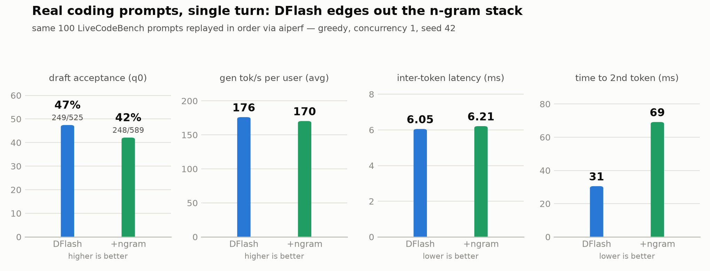

# DFlash benchmark story - draft branch vs main

Script / walkthrough for presenting the new test suite. Four benchmarks, told in
order: first prove DFlash loses nothing (math, then code), then measure speed on
real coding prompts, then show where the n-gram stack actually shines.

---

## What the draft branch adds over main

**New benchmark code**

| File | What it is |
|---|---|
| [benchmark/bench_ngram.py](benchmark/bench_ngram.py) + [bench_ngram.md](benchmark/bench_ngram.md) | Custom 18-turn iterative-coding benchmark (the n-gram showcase) |
| [benchmark/lcb_to_aiperf.py](benchmark/lcb_to_aiperf.py) | Extracts LiveCodeBench problems into an aiperf `inputs.json` (official prompt format + order) |
| [benchmark/lcb_speed.sh](benchmark/lcb_speed.sh) | Replays those LCB prompts through aiperf against any server variant (A/B speed test) |
| [benchmark/lcb_speed_compare.py](benchmark/lcb_speed_compare.py) | Side-by-side compare of two lcb_speed runs + automatic losslessness check via output lengths |
| [benchmark/data/lcb_release_v5_first100.inputs.json](benchmark/data/lcb_release_v5_first100.inputs.json) | The frozen 100-problem LCB dataset both servers replay |
| [benchmark/prefix_cache_probe.py](benchmark/prefix_cache_probe.py) | Multi-turn KV prefix-cache probe (does the server reprocess history each turn?) |
| [scripts/download_models.sh](scripts/download_models.sh) | One-shot model/GGUF downloader |

**Extended existing code**

- [benchmark/intelligence_sweep.sh](benchmark/intelligence_sweep.sh) - per-benchmark problem counts (`NDEF`), `lcb_codegeneration` track, `STOP=1` teardown
- [benchmark/speed_sweep.sh](benchmark/speed_sweep.sh) - new `ngram` variant
- [docker/docker-compose.yaml](docker/docker-compose.yaml) - new `llamacpp_dflash_ngram` service: DFlash draft model + two stacked model-free n-gram drafters (`ngram-mod`, `ngram-map-k4v`), fully env-tunable
- [benchmark/plot_results.py](benchmark/plot_results.py) - two new charts (`lcb_accuracy.png`, `ngram_ablation.png`), third series (green, +ngram) on the speed chart

**New results / artifacts**

- Full MATH-500 (N=500) accuracy runs for base and DFlash: `artifacts/{base,dflash}/accuracy/math_500/`
- LCB speed replays: `artifacts/{dflash,dflash_ngram}/lcb_speed/`
- n-gram speed sweeps: `artifacts/dflash_ngram/speed/`
- README: ~380 new lines of results narrative; `results.md` holds the raw console logs

---

## Benchmark 1 - Full MATH-500, base vs DFlash (accuracy)

**What it is.** aiperf's built-in `math_500` accuracy benchmark: 500 competition
math problems, graded pass@1 by answer extraction. Run once against the plain
Qwen3.6-27B server (`base`) and once against the same model with the DFlash
speculative drafter (`dflash`). Greedy (temperature 0, top_p 1, top_k 1),
sequential sampling, seed 42, reasoning off, one server on the GPU at a time.

**Why we do it.** Speculative decoding at temperature 0 is supposed to be
output-lossless - the target model verifies every drafted token, so the drafter
can only add speed, never change answers. This is the proof on a reasoning
workload, at full-set scale so the number is not a small-sample artifact.

**Headline result.** 440/500 (88.0%) base vs 435/500 (87.0%) DFlash - within
floating-point verification noise - while DFlash generated at 254.7 tok/s vs
73.1 tok/s (3.49x) during the very same run. Per-subject scores stay within 2
problems everywhere. Earlier paired N=100 run agrees: 87 vs 86.

**Code to show**

- [benchmark/intelligence_sweep.sh:42-51](benchmark/intelligence_sweep.sh#L42-L51) - the whole methodology in one aiperf call: `--accuracy-benchmark`, greedy `--extra-inputs`, sequential + seed 42
- [benchmark/intelligence_sweep.sh:21](benchmark/intelligence_sweep.sh#L21) - per-benchmark problem-count defaults (`NDEF`)

**Results to show**

- `assets/accuracy_vs_speed.png` and `assets/accuracy_by_subject.png`
- The `OVERALL` lines: `artifacts/base/accuracy/math_500/accuracy_results.csv` (440/500) vs `artifacts/dflash/accuracy/math_500/accuracy_results.csv` (435/500)

---

## Benchmark 2 - LiveCodeBench pass@1, base vs DFlash (lossless on code)

**What it is.** A partial LiveCodeBench code-generation run (58 problems,
release_v5, Aug 2024 window) graded by the **official LCB harness** - it
executes the generated programs against test cases - pointed at the same local
llama.cpp servers. Greedy, reasoning off, `LLAMA_CTX=40960`, `--n 1`.

**Why we do it.** Math parity is not enough: one flipped token in a long
program changes pass/fail, so code is the harshest losslessness test. Also:
aiperf's built-in `lcb_codegeneration` grader is **broken** (falsely reports 0%
on full runs even when the model returns correct, executable code - aiperf's own
grader scores the same code 1.0 in isolation), so the official harness is the
only trustworthy grader. That bug discovery is itself part of the story.

**Headline result.** 11/58 (19.0%) base vs 12/58 (20.7%) DFlash - a
single-problem gap, the same <=1-problem noise as MATH-500. Caveat to state on
screen: absolute scores are truncation-dominated (lcb_runner's default
`--max_tokens 2000` cut off 47/58 and 46/58 generations mid-reasoning; every
generation that fit the cap passed), so the *parity* is fair but ~20%
understates the model.

**Code to show**

- [benchmark/intelligence_sweep.sh:1-11](benchmark/intelligence_sweep.sh#L1-L11) - the `BENCHES=lcb_codegeneration` track header, then explain why we abandoned it (the aiperf 0% bug)
- README "Coding - LiveCodeBench pass@1" section - the bug explanation + the official-harness command

**Results to show**

- `assets/lcb_accuracy.png`
- The truncation caveat table (11/11 and 12/12 non-truncated generations passed)

---

## Interlude - the synthetic speed sweep (speed_vs_context.png)

**What it is.** The controlled speed measurement behind the context-scaling
chart: aiperf synthetic sweep at ISL = OSL = 512 / 4096 / 12288 / 36864,
greedy, concurrency 1, seed 42 ([speed_sweep.sh](benchmark/speed_sweep.sh)).
What is actually fed: **no clever prompt at all** - aiperf's synthetic
generator produces punctuation-stripped *Shakespeare* text cut to exactly N
tokens (open any `artifacts/*/speed/isl*/inputs.json` to show it - it is
literally Julius Caesar / King Lear). The output side is forced:
`temperature 0`, `ignore_eos:true`, `min_tokens:N`, so the model must emit
exactly N tokens whether it wants to stop or not.

**Where the boost comes from - say this on camera.**

- The **base model slows down** as context grows (67.6 -> 61.5 tok/s): single
  user decode is memory-bandwidth-bound, every token step re-reads the whole
  KV cache.
- **DFlash's speedup grows with context (1.43x -> 4.71x)** because the target
  verifies up to 15 drafted tokens in ONE batched forward pass - the expensive
  KV read is amortized over up to 16 tokens. The bigger the context, the more
  each single step costs, the more the amortization pays. This effect is
  prompt-independent and honest.
- **The ngram 8.47x at 36864 is a degenerate-output ceiling, not typical -
  verified by replaying the exact benchmark request (2026-07-15).** The
  suspicion "maybe the Shakespeare input repeats" is measurably wrong: every
  synthetic prompt has ~0% duplicate 12-grams and 0 duplicate 24-grams, and
  0.0% of the output's 12-grams appear in the input. What actually happens:
  the model starts a genuine *Love's Labour's Lost* continuation, then
  collapses into a two-line loop - "ARMADO: I will be faithful. / MOTH: And
  so will I, sir." - repeated **1,514 times**. 98.3% of output 12-grams are
  duplicates (quarters 2-4 of the output are 100% repetition). That
  self-repetition is exactly what the n-gram drafters copy: the replay
  measured **92% draft acceptance (35,898/38,908) and 748 tok/s** server-side
  decode - vs only 9-14% acceptance and 75-105 tok/s on the natural-story
  probe (`artifacts/dflash_ngram/speed/acceptance.txt`). The earlier ctx
  asymmetry is gone: the DFlash column was re-swept 2026-07-15 at ctx 256k,
  so both runs now generate the full 36,864 tokens - the pair is symmetric,
  and the ngram edge over plain DFlash at 36864 is **1.80x (521 vs 289)**.
  The degeneration lifts plain DFlash too (its ITL fell 3.68 -> 3.06 ms once
  the output ran full length), so both 36864 speedups are ceilings. At 512
  the ngram stack is actually *slower* than plain DFlash (91.9 vs 96.9).
  Quote bench_ngram's 6x / 7.5x as the realistic n-gram number, not 8.5x.

**Code to show**

- [benchmark/speed_sweep.sh:40-50](benchmark/speed_sweep.sh#L40-L50) - the aiperf call: `--synthetic-input-tokens-mean`, `ignore_eos:true`, `min_tokens:N`
- [benchmark/speed_sweep.sh:56-65](benchmark/speed_sweep.sh#L56-L65) - the per-size acceptance probe ("Write a very long story.")
- The TABLE 1 header in [benchmark/results_summary.csv:1](benchmark/results_summary.csv#L1) - all the caveats, written down
- Optionally open `artifacts/dflash_ngram/speed/isl4096_osl4096/inputs.json` live to show the Shakespeare

**Results to show**

- `assets/speed_vs_context.png`
- The README "Speed sweep" caveat list (the 36864 pair re-measurements)

---

## Benchmark 3 - LCB extraction + aiperf speed replay (DFlash vs DFlash+ngram)

**What it is.** The same 100 LiveCodeBench prompts, frozen to a file and
replayed in identical order through aiperf against each server variant. Two
steps:

1. [lcb_to_aiperf.py](benchmark/lcb_to_aiperf.py) extracts problems using the
   official LCB loader and prompt formatter, sorts them in official order, and
   embeds greedy sampling params inside every payload (aiperf sends inputs-json
   verbatim, so `--extra-inputs` would be ignored).
2. [lcb_speed.sh](benchmark/lcb_speed.sh) boots exactly one server on port 8001,
   patches the model alias, runs aiperf sequentially at concurrency 1 with a
   dedicated warmup entry, then probes one real prompt for
   `draft_n / draft_n_accepted` (acceptance is not on `/metrics`).

**Why we do it.** The synthetic speed sweep feeds Shakespeare filler - the
n-gram worst case - and bench_ngram is our own construction. This is the
neutral middle ground: *real* coding prompts, standardized tool (aiperf),
perfectly repeatable A/B. And because everything is greedy, [lcb_speed_compare.py](benchmark/lcb_speed_compare.py)
doubles as a losslessness check: if average output length differs >1% between
runs, the decodes diverged and it warns.

**Headline result.** DFlash alone wins, modestly: 47% vs 42% draft acceptance,
+3.4% per-user generation throughput, +10% on the controlled single-prompt
probe. n-gram is slow to warm up (time-to-2nd-token 69 ms vs 30 ms - it must
build its copy-cache first). Single-turn prompts with no prior code in context
give the n-gram drafters little to copy - which sets up benchmark 4.

Full numbers (aiperf averages over the 100-prompt replay; q0 = the controlled
single-prompt acceptance probe from `acceptance.txt`):

| Metric | **DFlash** | **DFlash+ngram** | Winner |
|---|---:|---:|---|
| q0 draft tokens accepted / drafted | **249 / 525 (47%)** | 248 / 589 (42%) | DFlash |
| q0 decode speed (tok/s) | **286.5** | 260.2 | DFlash (+10%) |
| Gen tok/s per user (avg) | **176.07** | 170.33 | DFlash (+3.4%) |
| E2E tok/s per user (avg) | **131.16** | 129.54 | DFlash (+1.3%) |
| Inter-token latency (avg, ms) | **6.05** | 6.21 | DFlash (-2.6%) |
| Time to 2nd token (avg, ms) | **30.53** | 69.13 | DFlash (warm-up gap) |
| TTFT (avg, ms) | 1,080 | **1,029** | ngram |
| Total output tokens (greedy paths diverged) | 260,196 | 251,186 | n/a - not comparable |

Read the q0 row out loud when presenting: the n-gram stack *drafted more*
(589 vs 525 tokens) but got the *same number accepted* (248 vs 249) - extra
drafting work, zero extra payoff, because a single-turn prompt has no prior
code in context to copy from.

**Code to show**

- [benchmark/lcb_to_aiperf.py:35-45](benchmark/lcb_to_aiperf.py#L35-L45) - `payload()`: greedy params baked into each request
- [benchmark/lcb_to_aiperf.py:62-63](benchmark/lcb_to_aiperf.py#L62-L63) - official dataset load + official string-sort order
- [benchmark/lcb_speed.sh:57-65](benchmark/lcb_speed.sh#L57-L65) - the aiperf replay call (sequential, concurrency 1, warmup)
- [benchmark/lcb_speed.sh:67-82](benchmark/lcb_speed.sh#L67-L82) - the draft-acceptance probe reading llama.cpp's `timings` block
- [benchmark/lcb_speed_compare.py:64-69](benchmark/lcb_speed_compare.py#L64-L69) - the OSL losslessness check

**Results to show**

- `assets/lcb_speed_ab.png` (the chart above) - acceptance, throughput, ITL, warm-up in one frame
- The full-numbers table above (also in the README "Real-prompt A/B" section)
- `artifacts/{dflash,dflash_ngram}/lcb_speed/acceptance.txt` - one-line probe results
- Regenerate the chart anytime: `uv run benchmark/plot_results.py` (data lives in TABLE 5 of [benchmark/results_summary.csv](benchmark/results_summary.csv))

---

## Benchmark 4 - bench_ngram: continuous coding on the same code (the n-gram payoff)

**What it is.** A custom headless benchmark:
[bench_ngram.py](benchmark/bench_ngram.py) sends 18 fixed prompts as ONE
cumulative conversation. Turns 1-9 (*build*) create a Gradio chat app and
extend the same file feature by feature; turns 10-18 (*maint*) are realistic
follow-ups on the finished app - full re-emit, docstrings+type hints, renames, a
vague bug report, a class refactor, pytest tests, an export feature,
review-and-fix, and a README turn as a prose control. Per turn it records TTFT,
decode tok/s, draft counts, and accept % straight from llama.cpp's `timings`
block, and aggregates overall and per phase.

**Why we do it.** This is the workload the n-gram lookup drafters exist for:
a model editing its own prior code keeps re-emitting verbatim spans that are
already sitting in context, and the n-gram drafters copy them for free. No
standard benchmark measures this - aiperf cannot see `draft_n_accepted`, and
llama.cpp's official speed-bench is single-turn only, so it structurally misses
the effect. Run once per server stack (baseline, dflash, and each
`LLAMA_SPEC_TYPE` ablation via `--tag`) and the script prints a comparison table
across all saved runs.

**Headline result.** The ablation ladder (decode tok/s, one 18-turn session
each): baseline 53.5 -> dflash 198.7 (3.71x) -> +map-k4v 200.6 -> +ngram-mod
304.3 -> full stack **321.5 (6.01x)**. On the maint phase the full stack hits
**385 tok/s, 7.5x baseline**. The kicker: the baseline *slows down* as context
grows (62.8 -> 48.9 tok/s) while the ngram stack *speeds up* (166 -> 325) -
more context means more to copy. 92% of output tokens come from accepted
drafts, and the target verifies every one, so output quality is unchanged.

**Code to show**

- [benchmark/bench_ngram.py:40-120](benchmark/bench_ngram.py#L40-L120) - the 18 turn prompts + `BENCH_PHASES` (show 2-3 maint prompts: "show me the complete final file", the docstring pass, the bug report)
- [benchmark/bench_ngram.py:178](benchmark/bench_ngram.py#L178) - `stream_turn()`: TTFT measured client-side, draft stats from `timings`
- [benchmark/bench_ngram.py:305](benchmark/bench_ngram.py#L305) - `aggregate()`: token-weighted decode tok/s (sum tokens / sum ms, so short turns don't skew)
- [docker/docker-compose.yaml:277-420](docker/docker-compose.yaml#L277-L420) - the `llamacpp_dflash_ngram` service; especially the `--spec-type` stack + inline ablation table around [lines 340-360](docker/docker-compose.yaml#L340-L360) and the per-drafter tuning flags ([lines 363-380](docker/docker-compose.yaml#L363-L380))

**Results to show**

- `assets/ngram_ablation.png` - and explain the two bars per row:
  - **blue = all 18 turns** (`decode_tps`): token-weighted decode tok/s over
    the whole session, build phase included. Turns 1-9 write mostly *new*
    code into a growing file, so there is less verbatim context to copy.
  - **green = turns 10-18 only** (`maint_tps`): the maintenance phase alone,
    where every turn edits or re-emits the *existing* file. This is the
    daily-driver "work on my code" scenario and the n-gram sweet spot.
  - The blue/green gap is itself the finding: baseline and plain DFlash show
    almost none (53.5 vs 51.3 and 198.7 vs 203.7 - the trained drafter does
    not care what phase it is in), while the ngram stacks pull far ahead on
    maint (304.3 -> 375.6, full stack 321.5 -> **385.0** = 7.5x the baseline's
    own maint 51.3).
- The ablation table + the early->late tok/s column (the "advantage grows with the session" point)
- Optionally `benchmark/bench_results/*/responses/NN.md` to show the app actually evolving

---

## Suggested presentation order

1. **Setup** - one model, three server configs (base / DFlash / DFlash+ngram), one GPU, everything greedy and seeded.
2. **Is it lossless? Math** - Benchmark 1: full MATH-500, 88.0% vs 87.0%, 3.5x faster while measured.
3. **Is it lossless? Code** - Benchmark 2: official LCB harness (after showing the aiperf 0% bug), 11/58 vs 12/58.
4. **How fast, in isolation?** - the synthetic sweep: DFlash speedup grows with context (1.4x -> 4x) because batched verification amortizes the KV read; flag the 8.5x ngram point as a degenerate-output ceiling.
5. **How fast on real prompts?** - Benchmark 3: LCB replay, DFlash alone wins single-turn; n-gram needs context to copy.
6. **Where n-gram earns its keep** - Benchmark 4: continuous coding, 6x overall, 7.5x on maintenance work, speed *rises* as the session grows.
7. **Close** - the drafter stack is free: target verifies every token, so you only ever trade a little wasted draft compute for up to 7.5x decode speed.
